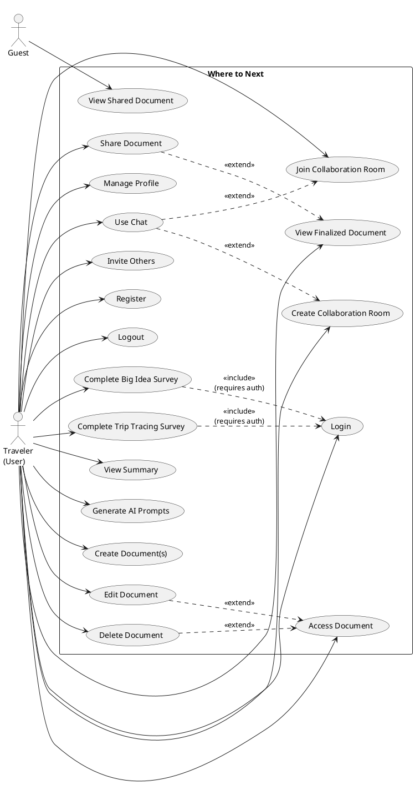

# Class Dictionary and UML Class Diagram Guide

This guide explains how to create **class dictionaries** and **UML class diagrams** for the where-to-next project. These documents are commonly used in software documentation and computer science coursework (e.g., IB Computer Science).

---

## Part 1: Class Dictionaries

### What is a Class Dictionary?

A **class dictionary** is a structured textual document that lists every class in a system, along with its **attributes** (data/properties) and **methods** (operations). It serves as a reference before or alongside a UML class diagram.

### Format Structure

Each class entry follows this structure:

```
CLASS NAME: [ClassName]
DESCRIPTION: [Brief description of the class's purpose]

ATTRIBUTES:
  visibility name: type [description]
  visibility name: type [description]
  ...

METHODS:
  visibility methodName(parameters): returnType [description]
  visibility methodName(parameters): returnType [description]
  ...
```

### Visibility Notation

| Symbol | Meaning   | Example in Code    |
|--------|-----------|--------------------|
| `+`    | Public    | `public getState()` |
| `-`    | Private   | `private connect()` |
| `#`    | Protected | `# internalMethod()` |

---

### Example 1: CollaborationService (Frontend)

**CLASS NAME:** CollaborationService  
**DESCRIPTION:** Manages WebSocket connections and real-time collaboration state for trip planning. Uses singleton pattern with encapsulated connection state.

**ATTRIBUTES:**
| Visibility | Name | Type | Description |
|------------|------|------|-------------|
| - | ws | WebSocket \| null | WebSocket connection instance |
| - | state | CollaborationState | Current collaboration state (connected, users, messages) |
| - | callbacks | CollaborationCallbacks | Event handlers for connection/message events |
| - | reconnectAttempts | number | Count of reconnection attempts |
| - | maxReconnectAttempts | number | Maximum retry limit (5) |
| - | reconnectDelay | number | Delay between retries (ms) |
| - | typingTimeout | NodeJS.Timeout \| null | Timeout for typing indicator |
| - | pendingJoinRoom | object \| null | Pending room join request data |
| - | heartbeatInterval | NodeJS.Timeout \| null | Heartbeat timer for connection keep-alive |
| - | connectionDebounceTimeout | NodeJS.Timeout \| null | Debounce timer for connection attempts |
| - | isConnecting | boolean | Flag to prevent duplicate connection attempts |

**METHODS:**
| Visibility | Method | Parameters | Return | Description |
|------------|--------|------------|--------|-------------|
| - | constructor | — | — | Initializes service, waits for authentication |
| - | connect | — | void | Establishes WebSocket connection (debounced) |
| - | performConnection | — | void | Executes actual connection logic |
| - | attemptReconnect | — | void | Retries connection after failure |
| - | handleMessage | message: any | void | Processes incoming WebSocket messages |
| - | handleUserJoined | user: CollaborationUser | void | Handles user joined event |
| - | handleUserLeft | user: CollaborationUser | void | Handles user left event |
| - | handleRoomDeleted | roomId: string, message: string | void | Handles room deletion |
| - | handleChatMessage | message: CollaborationMessage | void | Handles incoming chat message |
| - | handleChatHistory | messages: CollaborationMessage[] | void | Loads chat history |
| - | handlePreferencesUpdate | preferences: any, updatedBy: CollaborationUser | void | Handles preference sync |
| - | handleTripTracingUpdate | tripTracingState: any, updatedBy: CollaborationUser | void | Handles trip tracing sync |
| - | handleUserTyping | user: CollaborationUser, isTyping: boolean | void | Handles typing indicator |
| - | handleTripState | message: any | void | Handles trip state message |
| - | handleSyncData | message: any | void | Handles sync data message |
| - | sendJoinRoomMessage | roomId, userId, userName, isRoomCreator | void | Sends join room message |
| - | startHeartbeat | — | void | Starts connection heartbeat |
| - | stopHeartbeat | — | void | Stops connection heartbeat |
| + | setCallbacks | callbacks: CollaborationCallbacks | void | Registers event callbacks |
| + | joinTrip | tripId: string | void | Joins a trip room |
| + | leaveTrip | tripId?: string | void | Leaves current trip room |
| + | sendMessage | message: any | void | Sends generic WebSocket message |
| + | sendChatMessage | text: string | void | Sends chat message |
| + | updatePreferences | preferences: any | void | Broadcasts preference update |
| + | updateTripTracing | tripTracingState: any | void | Broadcasts trip tracing update |
| + | setTyping | isTyping: boolean | void | Sets typing indicator |
| + | requestSync | — | void | Requests data sync from server |
| + | joinRoom | roomId, userId, userName, isRoomCreator? | void | Joins collaboration room |
| + | disconnect | — | void | Disconnects WebSocket |
| + | getState | — | CollaborationState | Returns current state |
| + | isConnected | — | boolean | Returns connection status |
| + | getCurrentTripId | — | string \| null | Returns current trip ID |
| + | getOnlineUsers | — | CollaborationUser[] | Returns online users |
| + | getMessages | — | CollaborationMessage[] | Returns messages |
| + | getLastError | — | string \| null | Returns last error |
| + | testConnection | — | Promise\<boolean\> | Tests API connectivity |
| + | forceReconnect | roomId?, userId?, userName?, isRoomCreator? | void | Forces reconnection |
| + | manualConnect | — | void | Manually triggers connection |
| + | getConnectionStatus | — | any | Returns connection status details |

---

### Example 2: PromptService (Frontend)

**CLASS NAME:** PromptService  
**DESCRIPTION:** Generates AI prompts for travel planning based on user preferences and trip tracing data. Exported as singleton instance.

**ATTRIBUTES:**
| Visibility | Name | Type | Description |
|------------|------|------|-------------|
| *(none—helper methods only)* | | | No persistent attributes |

**METHODS:**
| Visibility | Method | Parameters | Return | Description |
|------------|--------|------------|--------|-------------|
| - | getPlanningStyleText | planningStyle: any | string | Converts planning style to readable text |
| - | getDurationAndDatesText | duration: any | string | Formats duration and dates for prompt |
| - | getBudgetText | tripPreferences: any | string | Formats budget with currency for prompt |
| + | generateBigPicturePrompt | request: PromptRequest | GeneratedPrompt | Generates big picture travel prompt |
| + | generateDestinationsPrompt | request: PromptRequest | GeneratedPrompt | Generates destination suggestion prompt |
| + | generateTripTracingPrompt | request: PromptRequest | GeneratedPrompt | Generates trip tracing advice prompt |
| + | generateFinalItineraryPrompt | request: PromptRequest | GeneratedPrompt | Generates final itinerary prompt |

---

### Example 3: User (Backend - Mongoose Model)

**CLASS NAME:** User  
**DESCRIPTION:** Mongoose model representing a registered user. Handles password hashing and authentication.

**ATTRIBUTES:**
| Visibility | Name | Type | Description |
|------------|------|------|-------------|
| + | email | string | User email (unique, required) |
| + | password | string | Hashed password (min 8 chars) |
| + | name | string | User display name |
| + | createdAt | Date | Account creation timestamp |
| + | lastLogin | Date | Last login timestamp |

**METHODS:**
| Visibility | Method | Parameters | Return | Description |
|------------|--------|------------|--------|-------------|
| + | comparePassword | candidatePassword: string | Promise\<boolean\> | Compares password with hash |

*Note: `pre('save')` middleware hashes password before saving.*

---

### Example 4: Document (Backend - Mongoose Model)

**CLASS NAME:** Document  
**DESCRIPTION:** Mongoose model for trip documents. Stores destination, survey data, calendar planner, and editable fields.

**ATTRIBUTES:**
| Visibility | Name | Type | Description |
|------------|------|------|-------------|
| + | userId | ObjectId | Reference to User (creator) |
| + | destinationName | string | Destination name |
| + | surveyData | Mixed | Legacy survey data |
| + | bigIdeaSurveyData | Mixed | Big Idea survey results |
| + | tripTracingSurveyData | Mixed | Trip Tracing survey results |
| + | isAutoCreated | boolean | Auto-created document flag |
| + | surveyOrigin | object | Survey IDs and metadata |
| + | calendarPlanner | object | Duration, dates, timeSlots |
| + | optionsOrganizer | object | Accommodation, meals, activities |
| + | editableFields | object | User-editable fields |
| + | createdAt | Date | Creation timestamp |
| + | lastModified | Date | Last modification timestamp |

**METHODS:**
| Visibility | Method | Parameters | Return | Description |
|------------|--------|------------|--------|-------------|
| *(Mongoose defaults)* | save | — | Promise | Persists document; updates lastModified |

---

### Supporting Types / Interfaces (for Class Dictionary)

When documenting TypeScript interfaces or complex types used by classes, list them as data structures:

**CollaborationUser:** id, name, email, isOnline?, joinedAt?, lastSeen?, isCreator?  
**CollaborationMessage:** id, text, user (CollaborationUser), timestamp  
**CollaborationState:** isConnected, currentTripId, onlineUsers, messages, isTyping, lastError  
**CollaborationCallbacks:** onConnectionChange?, onUserJoined?, onUserLeft?, onMessage?, etc.  
**PromptRequest:** type, tripPreferences, tripTracingState?, destinationCount?  
**GeneratedPrompt:** title, description, tips, prompt?, preferencesPrompt?, destinationPrompt?, links  

---

## Part 2: UML Class Diagrams

### What is a UML Class Diagram?

A **UML class diagram** is a visual representation of the system's classes, their attributes, methods, and relationships. It uses standard notation defined by the Unified Modeling Language.

### Basic Class Box Notation

```
┌─────────────────────────────────────┐
│ ClassName                           │  ← Class name (bold)
├─────────────────────────────────────┤
│ - privateAttribute: type            │  ← Attributes
│ + publicAttribute: type              │     (- private, + public, # protected)
│ # protectedAttribute: type           │
├─────────────────────────────────────┤
│ + publicMethod(): returnType         │  ← Methods
│ - privateMethod(): void              │
│ # protectedMethod(params): type      │
└─────────────────────────────────────┘
```

### Visibility Symbols

| Symbol | Meaning   |
|--------|-----------|
| `+`    | Public    |
| `-`    | Private   |
| `#`    | Protected |
| `~`    | Package (default) |

### Relationship Types

| Relationship | Symbol/Line | Meaning | Example |
|--------------|-------------|---------|---------|
| **Association** | `──────→` | Class A uses Class B | CollaborationService uses WebSocket |
| **Aggregation** | `◇──────→` | "Has-a" (weak whole–part) | Document has TimeSlot[] |
| **Composition** | `◆──────→` | "Contains" (strong whole–part) | CollaborationState contains CollaborationUser[] |
| **Inheritance** | `△──────→` | "Is-a" (subclass extends superclass) | *(not used in where-to-next)* |
| **Dependency** | `- - - - →` | Class A depends on Class B | PromptService depends on PromptRequest |
| **Realization** | `- - - △` | Class implements interface | *(for TypeScript interfaces)* |

### Multiplicity Notation

Place on the ends of relationship lines:

| Notation | Meaning        |
|----------|----------------|
| `1`      | Exactly one    |
| `0..1`   | Zero or one    |
| `*` or `0..*` | Zero or many |
| `1..*`   | One or many    |
| `n`      | Exactly n      |

---

### Step-by-Step: Creating a UML Class Diagram

#### Step 1: Identify Classes

List all classes from your class dictionary:
- Frontend: `CollaborationService`, `PromptService`
- Backend: `User`, `Document`, `TripPreferences`, `TripTracingState`, etc.

#### Step 2: Draw Each Class Box

For each class, create a box with three compartments:
1. **Name** (top)
2. **Attributes** (middle)—visibility, name, type
3. **Methods** (bottom)—visibility, name, parameters, return type

#### Step 3: Add Relationships

Draw lines between classes:

- **Document → User:** Document has `userId` (ObjectId ref) → association with multiplicity `*` to `1`
- **CollaborationService → CollaborationState:** CollaborationService contains state → composition
- **CollaborationService → CollaborationUser:** State contains `onlineUsers: CollaborationUser[]` → composition
- **CollaborationService → CollaborationMessage:** State contains `messages: CollaborationMessage[]` → composition
- **PromptService → PromptRequest:** PromptService uses PromptRequest → dependency
- **PromptService → GeneratedPrompt:** PromptService returns GeneratedPrompt → dependency

#### Step 4: Simplify (Optional)

For large systems, you can:
- Show only class names (no attributes/methods)
- Group related classes in packages
- Create separate diagrams for frontend vs. backend

---

### ASCII Example: Simplified UML for where-to-next

```
┌─────────────────────────┐         ┌─────────────────────────┐
│ CollaborationService    │         │ CollaborationState      │
├─────────────────────────┤         ├─────────────────────────┤
│ - ws: WebSocket|null    │         │ - isConnected: boolean   │
│ - state: CollaborationState│◆─────│ - currentTripId: string?│
│ - callbacks: object      │         │ - onlineUsers: User[]   │
│ - isConnecting: boolean  │         │ - messages: Message[]   │
├─────────────────────────┤         │ - lastError: string?     │
│ + joinRoom(...)         │         └─────────────────────────┘
│ + sendChatMessage(text) │                    ◆
│ + getState()            │                    │
│ + disconnect()          │         ┌──────────┴──────────┐
└─────────────────────────┘         │                     │
                                     ▼                     ▼
                        ┌────────────────────┐  ┌────────────────────┐
                        │ CollaborationUser  │  │ CollaborationMessage│
                        ├────────────────────┤  ├────────────────────┤
                        │ + id: string       │  │ + id: string        │
                        │ + name: string     │  │ + text: string      │
                        │ + email: string    │  │ + user: User        │
                        └────────────────────┘  │ + timestamp: string │
                                                 └────────────────────┘

┌─────────────────────────┐         ┌─────────────────────────┐
│ PromptService           │ - - - → │ PromptRequest            │
├─────────────────────────┤         ├─────────────────────────┤
│ (no attributes)         │         │ + type: string           │
├─────────────────────────┤         │ + tripPreferences        │
│ + generateBigPicture...  │ - - - → │ + tripTracingState?      │
│ + generateDestinations..│         └─────────────────────────┘
│ + generateTripTracing... │
│ + generateFinalItinerary│         ┌─────────────────────────┐
└─────────────────────────┘         │ GeneratedPrompt         │
                                     ├─────────────────────────┤
                                     │ + title: string         │
                                     │ + description: string   │
                                     │ + tips: string[]        │
                                     │ + prompt?: string       │
                                     └─────────────────────────┘

┌─────────────────────────┐         ┌─────────────────────────┐
│ Document                │ 1     * │ User                     │
├─────────────────────────┤ ──────→ ├─────────────────────────┤
│ + userId: ObjectId       │         │ + email: string          │
│ + destinationName: str  │         │ + password: string       │
│ + bigIdeaSurveyData     │         │ + name: string           │
│ + calendarPlanner       │         │ + createdAt: Date        │
│ + editableFields        │         ├─────────────────────────┤
└─────────────────────────┘         │ + comparePassword(...)   │
                                     └─────────────────────────┘
```

---

## Part 3: UML Use Case Diagrams

### What is a Use Case Diagram?

A **UML use case diagram** shows the **functional requirements** of a system from the user's perspective. It illustrates:
- **Actors** (who interacts with the system)
- **Use cases** (what the system does)
- **Relationships** between actors and use cases
- **Dependencies** between use cases (`«include»` and `«extend»`)

### Notation Overview

| Element | Symbol | Description |
|---------|--------|-------------|
| **Actor** | Stick figure | A user or external system that interacts with the application |
| **Use case** | Oval | A functionality or feature the system provides |
| **System boundary** | Rectangle | Frames all use cases; system name at top |
| **Association** | Solid line | Actor initiates or participates in the use case |
| **Include** | Dashed arrow with `«include»` | Base use case *always* includes the target behavior |
| **Extend** | Dashed arrow with `«extend»` | Target use case *optionally* extends the base use case |

### Include vs. Extend

| Relationship | When to use | Example |
|--------------|-------------|---------|
| **«include»** | The included behavior is **mandatory**—it always happens when the base use case runs | "Complete Big Idea Survey" «include» "Save preferences" (saving always happens) |
| **«extend»** | The extending behavior is **optional**—it may or may not happen | "View Finalized Document" «extend» "Share Document" (sharing is optional) |

*Arrow direction:*
- **Include:** Arrow points FROM base use case TO included use case (base includes target)
- **Extend:** Arrow points FROM extending use case TO base use case (extender adds to base)

---

### where-to-next Use Case Diagram

#### Actors

| Actor | Description |
|-------|-------------|
| **Traveler (User)** | Authenticated user who plans trips, completes surveys, manages documents |
| **Guest** | Unauthenticated user who accesses a shared document via share code |
| **Backend API** | External system for authentication, document storage, and collaboration |

#### Use Cases (by flow)

| Category | Use Case | Description |
|----------|----------|-------------|
| **Auth** | Register | Create new account |
| **Auth** | Login | Authenticate to access protected features |
| **Auth** | Logout | Sign out of account |
| **Survey** | Complete Big Idea Survey | Answer questions about trip preferences (group size, duration, budget, destination, vibe, etc.) |
| **Survey** | Complete Trip Tracing Survey | Answer detailed trip questions (accommodation, transport, meals, expenses, activities) |
| **Survey** | View Summary | See survey summary and choose next steps |
| **AI** | Generate AI Prompts | Get prompts for ChatGPT/Claude/Gemini (big picture, destinations, trip tracing, itinerary) |
| **Document** | Create Document(s) | Auto-create documents from survey or create manually |
| **Document** | Access Document | Open document from Profile (view list, select document) |
| **Document** | Edit Document | Modify document details (dates, budget, transportation, etc.) |
| **Document** | Delete Document | Remove a document |
| **Document** | View Finalized Document | View complete travel handbook |
| **Document** | Share Document | Generate share code for others to view |
| **Document** | View Shared Document | Access document via share code (no login required) |
| **Profile** | Manage Profile | View and manage documents, saved preferences, flight strategies, expense policies |
| **Collaboration** | Create Collaboration Room | Create a room for real-time trip planning |
| **Collaboration** | Join Collaboration Room | Join existing room with share code |
| **Collaboration** | Use Chat | Send and receive messages in collaboration room |
| **Collaboration** | Invite Others to Room | Share room code to invite collaborators |

---

### Suggested Relationships

#### Associations (Actor → Use Case)

- **Traveler** is associated with: Register, Login, Logout, Complete Big Idea Survey, Complete Trip Tracing Survey, View Summary, Generate AI Prompts, Create Document(s), Access Document, Edit Document, Delete Document, View Finalized Document, Share Document, Manage Profile, Create Collaboration Room, Join Collaboration Room, Use Chat, Invite Others to Room
- **Guest** is associated with: View Shared Document (and Login/Register if they want to create their own)
- **Backend API** is associated with: Login, Register, Create Document(s), Share Document, View Shared Document (data persistence)

#### Include Relationships

| Base Use Case | «include» | Included Use Case | Reason |
|---------------|-----------|-------------------|--------|
| Complete Big Idea Survey | → | Save preferences | Preferences are always saved when survey is completed |
| Complete Trip Tracing Survey | → | Save trip tracing data | Data is always persisted |
| Create Document(s) | → | Save document | Document creation always saves to storage |
| Share Document | → | Generate share code | Sharing always produces a code |
| Create Collaboration Room | → | Generate room code | Room creation produces an invite code |

#### Extend Relationships

| Base Use Case | «extend» | Extending Use Case | Reason |
|---------------|----------|--------------------|--------|
| Access Document | ← | Edit Document | Editing is optional when viewing a document |
| Access Document | ← | Delete Document | Deleting is optional when viewing a document |
| View Finalized Document | ← | Share Document | User may optionally share after viewing |
| Create Collaboration Room | ← | Use Chat | User may optionally chat after creating room |
| Join Collaboration Room | ← | Use Chat | User may optionally chat after joining room |

---

### ASCII Representation: where-to-next Use Case Diagram

```
                    ┌─────────────────────────────────────────────────────────────────────────────────────┐
                    │                          Where to Next (Travel Planning App)                         │
                    │                                                                                      │
    Traveler ───────┼─── Register ──────── Login ──────── Logout                                            │
    (User)          │       │                 │                                                           │
         │          │       └─────────────────┴───────────────────────────────────────────────────┐      │
         │          │                                                                               │      │
         │          │   Complete Big Idea Survey ─────«include»────→ Savepreferences               │      │
         │          │         │                                                                     │      │
         │          │         └─────────────────────────────────────────────────────────────────────┘      │
         │          │   Complete Trip Tracing Survey ─«include»─→ Save trip tracing data                   │
         │          │         │                                                                             │
         │          │   View Summary                                                                       │
         │          │         │                                                                             │
         │          │   Generate AI Prompts                                                                 │
         │          │                                                                                       │
         │          │   Create Document(s) ─«include»→ Save document                                        │
         │          │         │                                                                             │
         │          │   Access Document ◄──«extend»── Edit Document                                         │
         │          │         │              «extend»── Delete Document                                      │
         │          │         │                                                                             │
         │          │   View Finalized Document ◄──«extend»── Share Document                               │
         │          │         │                                                                             │
         │          │   Manage Profile                                                                      │
         │          │                                                                                       │
         │          │   Create Collaboration Room ─«include»→ Generate room code                            │
         │          │         │                        ◄──«extend»── Use Chat                                │
         │          │   Join Collaboration Room ──────┘                                                     │
         │          │         │                        ◄──«extend»── Use Chat                                │
         │          │   Invite Others to Room                                                               │
         │          │                                                                                       │
                    └─────────────────────────────────────────────────────────────────────────────────────┘

    Guest  ───────────────────────────────────────────────────────────────────────────────────────────────
         │                                                                                       │
         └────────────────────────────────────── View Shared Document ──────────────────────────┘
```

---

### Mermaid Syntax: where-to-next Use Case Diagram

Mermaid does not have native use case diagram support, but you can approximate with a flowchart or use PlantUML. Here is a **PlantUML** version you can render at [plantuml.com](https://www.plantuml.com/plantuml/uml/):



---

### Step-by-Step: Creating a Use Case Diagram

1. **Identify actors**
   - Who uses the system? (Traveler, Guest)
   - What external systems does it talk to? (Backend API, if you want to show it)

2. **List use cases**
   - One use case per user goal.
   - Use verb phrases: "Complete Survey", "Share Document", etc.

3. **Draw system boundary**
   - Rectangle around all use cases; system name at top.

4. **Draw associations**
   - Solid lines from each actor to the use cases they perform.

5. **Add include relationships**
   - Use when the base use case always triggers another behavior.
   - Arrow from base → included use case, labeled `«include»`.

6. **Add extend relationships**
   - Use when another behavior optionally adds to a base use case.
   - Arrow from extending → base use case, labeled `«extend»`.

7. **Review**
   - Fix typos (e.g., your draft had "documet").
   - Ensure include/extend match actual behavior.
   - Keep the diagram readable (split if needed).

---

### Improvements Over Your Draft

| Your draft | Suggested change |
|------------|------------------|
| "Answer what kind of trip..." and "Answer details..." as separate use cases | Combine into "Complete Big Idea Survey" and "Complete Trip Tracing Survey" (matches actual pages) |
| "Answer throughout the survey" | Replace with the two survey use cases above |
| "Chatbox" as standalone use case | Split into "Use Chat", "Create Collaboration Room", "Join Collaboration Room" |
| "Profile page" | Rename to "Manage Profile" (verb form) |
| "Delete the documet" | Fix typo: "Delete Document" |
| Dependencies without stereotypes | Add `«include»` or `«extend»` where appropriate |
| Single "Client" actor | Add "Guest" for shared document access |

---

## Summary Checklist

**For Class Dictionaries:**
- [ ] List every class in the system
- [ ] For each class: name, description, attributes, methods
- [ ] Use visibility symbols (+, -, #)
- [ ] Include parameter types and return types
- [ ] Document supporting interfaces/types

**For UML Class Diagrams:**
- [ ] Draw class boxes with name, attributes, methods
- [ ] Use correct visibility symbols
- [ ] Add relationship lines with multiplicity
- [ ] Choose relationship type (association, composition, etc.)
- [ ] Keep diagram readable—split if too large

**For UML Use Case Diagrams:**
- [ ] Identify all actors (users and external systems)
- [ ] List use cases as verb phrases (e.g., "Complete Survey", "Share Document")
- [ ] Draw system boundary around use cases
- [ ] Connect actors to use cases with solid association lines
- [ ] Add `«include»` for mandatory sub-behaviors (arrow: base → included)
- [ ] Add `«extend»` for optional behaviors (arrow: extender → base)
- [ ] Fix typos and use consistent naming

---

## References

- [UML 2.5 Specification](https://www.omg.org/spec/UML/)
- [PlantUML Class Diagram Guide](https://plantuml.com/class-diagram)
- [PlantUML Use Case Diagram Guide](https://plantuml.com/use-case-diagram)
- [Mermaid Class Diagrams](https://mermaid.js.org/syntax/classDiagram.html)
